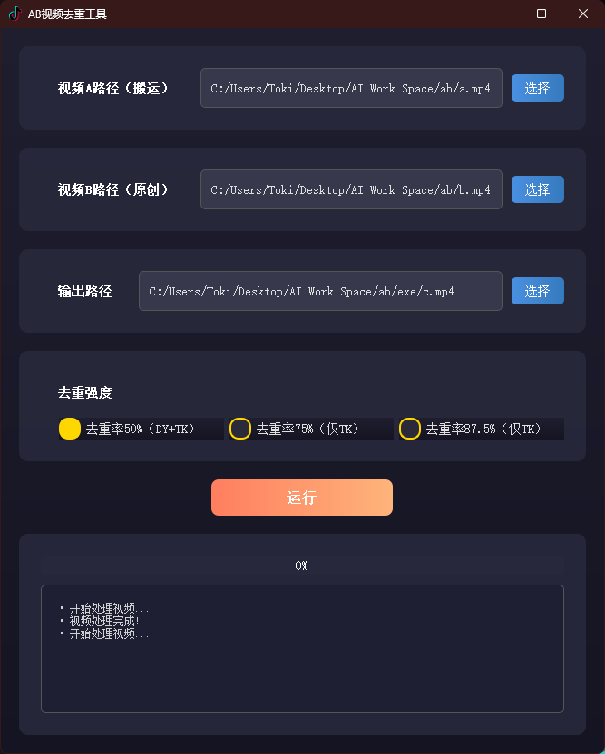

### 项目功能介绍

> 该项目可通过调整去重参数，理论上实现 100% 视频去重成功率，需自行对视频质量与去重成功率进行权衡。

#### 视频下载功能

自动监听TikTok指定博主的视频发布状态，当监听到该博主发布新视频后，自动将视频下载到本地并执行视频去重。

#### 视频去重功能

- GPU加速去重
- 自动识别音频并生成字幕
- 自定义顶、底部标题（颜色可选）
- 自定义字体、文字外边框
- 自动检测并去除静音部分
- 自动添加指定背景音乐
- 自动对视频进行镜像、旋转、裁剪
- 自动添加视频淡入淡出
- 自动添加视频画中画
- 自动调整视频饱和度、亮度、对比度
- 视频背景模糊、高斯模糊、帧交换、颜色偏移、频域扰乱、纹理噪声、边缘模糊

> 需要AB视频去重工具的可以到最下方联系我
>
> 
>
> 演示
> 
> <iframe src="//player.bilibili.com/player.html?isOutside=true&aid=114770166422455&bvid=BV1HwgrzbEow&cid=30769351545&p=1" scrolling="no" border="0" frameborder="no" framespacing="0" allowfullscreen="true"></iframe>

#### 视频上传功能

- 视频去重完毕后，调用阿里云百炼AI大模型分析该视频，自动生成爆款短视频标题+标签
- 自动打开浏览器登录视频号后台，自动填写信息并发布内容

### 脚本视频教程

<iframe src="//player.bilibili.com/player.html?isOutside=true&aid=114173367294645&bvid=BV1txQeYyEEz&cid=28902886633&p=1" scrolling="no" border="0" frameborder="no" framespacing="0" allowfullscreen="true"></iframe>

### 前置条件

- dotnet：https://dotnet.microsoft.com/en-us/download/dotnet-framework/thank-you/net48-web-installer
- v2rayN：https://github.com/2dust/v2rayN/releases/download/5.39/v2rayN-Core.zip
- Chrome：https://www.google.com/
- Python：https://www.python.org/ftp/python/3.12.9/python-3.12.9-amd64.exe
- Node.js：https://nodejs.org/dist/v22.14.0/node-v22.14.0-x64.msi
- Git：https://git-scm.com/downloads/win
- VSCode：https://code.visualstudio.com/Download
- ffmpeg：https://github.com/GyanD/codexffmpeg/releases/download/7.1.1/ffmpeg-7.1.1-full_build.7z

### 修改步骤

1. 双击`setup.bat`安装环境

2. 修改`C:/Program Files/Python312/Lib/site-packages/f2/apps/tiktok/handler.py`第389行，将`cursor`改为`int(cursor)`

3. 修改`C:/Program Files/Python312/Lib/site-packages/f2/utils/utils.py`

   ```python
   # 第200行，将：
   if date_type == "start":
       date_str = f"{start_date} 00-00-00"
   elif date_type == "end":
       date_str = f"{end_date} 23-59-59"
   else:
       logger.warning(_("不支持的日期类型：{0}").format(date_type))
       return 0
   # 改为：
   if len(start_date.split()) == 1:
       if date_type == "start":
           date_str = f"{start_date} 00-00-00"
       elif date_type == "end":
           date_str = f"{end_date} 23-59-59"
       else:
           logger.warning(_("不支持的日期类型：{0}").format(date_type))
           return 0
   else:
       if date_type == "start":
           date_str = f"{start_date}"
       elif date_type == "end":
           date_str = f"{end_date}"
       else:
           logger.warning(_("不支持的日期类型：{0}").format(date_type))
           return 0
   

   # 第690行，将：
   start_date = datetime.datetime.strptime(start_str, "%Y-%m-%d")
   end_date = datetime.datetime.strptime(end_str, "%Y-%m-%d") + datetime.timedelta(
       days=1, seconds=-1
   )
   
   # 改为：
   if len(start_str.split()) == 1:
       start_date = datetime.datetime.strptime(start_str, "%Y-%m-%d")
   else:
       start_date = datetime.datetime.strptime(start_str, "%Y-%m-%d %H-%M-%S")
   if len(end_str.split()) == 1:
       end_date = datetime.datetime.strptime(end_str, "%Y-%m-%d") + datetime.timedelta(days=1, seconds=-1)
   else:
       end_date = datetime.datetime.strptime(end_str, "%Y-%m-%d %H-%M-%S")
   ```

4. 修改`C:\Users\Administrator\Desktop\mover_v3\Upload\uploader\tencent_uploader\main.py`

   ```python
   # 第191行，将：
   await page.wait_for_url("https://channels.weixin.qq.com/platform/post/list", timeout=1500)
   
   # 改为：
   await page.wait_for_url("https://channels.weixin.qq.com/platform/post/list", timeout=10000)
   ```

5. 申请并修改`C:\Users\Toki\Desktop\Project\video-mover\Upload\vx_upload.py`中的阿里云百炼`api_key`

6. 访问`TikTok`网页获取`Cookie`并将其替换到`my_apps.yaml`中

7. 双击`start.bat`，等待登陆后点击开发者工具的绿色三角形箭头

8. （可选）修改`video-mover`目录下`my_apps.yaml`中的`Proxy`配置

### 交流

微信: toki-plus
