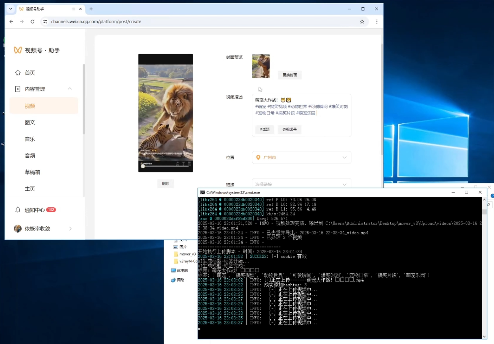

# Video Mover: 全自动视频搬运、去重与发布工作流

[简体中文](./README.md) | [English](./README_en.md)

[](https://github.com/toki-plus/video-mover/stargazers)
[](https://github.com/toki-plus/video-mover/network/members)
[](https://choosealicense.com/licenses/mit/)
[](https://github.com/toki-plus/video-mover/pulls)

**Video Mover 是一款强大的、全自动化的内容创作流水线工具，旨在实现从视频源监控下载、深度二次创作到多平台自动发布的无人值守工作流。**

本项目为需要大规模、高效率进行视频内容分发和二次创作的团队及个人设计，通过模块化的设计，将复杂的视频处理流程集成为一套完整的自动化解决方案。

<p align="center">
  <a href="https://www.bilibili.com/video/BV1txQeYyEEz" target="_blank">
    
  </a>
  <br>
  <em>(点击封面图跳转到 B 站观看高清演示视频)</em>
</p>

---

## ✨ 核心功能

-   **📥 自动下载 (Auto-Download)**
    -   **实时监控**：7x24小时自动监听指定TikTok博主的发布状态。
    -   **即时下载**：一旦发布新视频，立即无水印下载到本地，为后续处理做准备。

-   **✂️ 智能去重 (Intelligent Deduplication)**
    -   提供一套强大的视频二次创作工具箱，所有功能均可配置和组合，以达到理想的去重效果。
    -   **性能优化**: **🚀 GPU加速**，利用NVIDIA显卡大幅提升处理速度。
    -   **内容增强**: 自动字幕、自定义标题、背景音乐 (BGM)、画中画 (PIP)。
    -   **视频处理**: 静音剪辑、镜像、旋转、裁剪、淡入淡出、画质调整。
    -   **高级特效**: 背景模糊、帧交换、颜色偏移、频域扰乱、纹理噪声等数十种视觉特效。

-   **🚀 AI 驱动上传 (AI-Powered Upload)**
    -   **AI标题生成**：调用阿里云百炼AI大模型，分析视频内容，自动生成爆款标题和标签。
    -   **自动化发布**：模拟浏览器操作，登录视频号后台，自动填写所有信息并发布视频。

## 📸 软件截图

<p align="center">
  
  <br>
  <em>脚本运行展示图。</em>
</p>

## 🚀 快速开始

请严格按照以下步骤进行环境配置和安装。

### 系统要求

1.  **操作系统**: Windows。
2.  **软件/工具**:
    | 软件/工具              | 下载链接                                                     | 备注                                                     |
    | :--------------------- | :----------------------------------------------------------- | :------------------------------------------------------- |
    | **.NET Framework 4.8** | [官方下载](https://dotnet.microsoft.com/en-us/download/dotnet-framework/thank-you/net48-web-installer) | Windows 系统组件。                                       |
    | **Python 3.12+**       | [官方下载](https://www.python.org/ftp/python/3.12.9/python-3.12.9-amd64.exe) | 安装时请务必勾选 `Add Python to PATH`。                  |
    | **Node.js 22.x**       | [官方下载](https://nodejs.org/dist/v22.14.0/node-v22.14.0-x64.msi) | 建议选择 LTS 版本。                                      |
    | **Git**                | [官方下载](https://git-scm.com/downloads/win)                | 版本控制工具。                                           |
    | **FFmpeg**             | [Gyan.dev Builds](https://github.com/GyanD/codexffmpeg/releases/download/7.1.1/ffmpeg-7.1.1-full_build.7z) | **必须**解压并将其 `bin` 目录添加到系统环境变量 `PATH`。 |
    | **Chrome 浏览器**      | [官方下载](https://www.google.com/)                          | 用于自动化上传。                                         |
    | **v2rayN** (可选)      | [GitHub Releases](https://github.com/2dust/v2rayN/releases/download/5.39/v2rayN-Core.zip) | 如果你需要网络代理来访问TikTok。                         |

### 安装与配置

1.  **克隆本仓库：**
    ```bash
    git clone https://github.com/toki-plus/video-mover.git
    cd video-mover
    ```

2.  **自动安装依赖：**
    双击运行项目根目录下的 `setup.bat` 脚本。它会自动安装所有必要的 Python 和 Node.js 依赖。

3.  **⚠️ 重要：手动修改依赖库**
    由于特定功能需求，部分已安装的Python库需要进行少量代码修改。**这是保证程序正常运行的关键步骤**。请在虚拟环境中找到对应文件并修改：

    -   **文件 1**: `f2/apps/tiktok/handler.py`
        -   **位置**: 第 `389` 行
        -   **操作**: 将 `cursor` 强制转换为 `int` 类型。
        -   **修改前**: `params={"cursor": cursor, ...}`
        -   **修改后**: `params={"cursor": int(cursor), ...}`

    -   **文件 2**: `f2/utils/utils.py`
        -   **位置**: 第 `200` 行附近
        -   **操作**: 修改日期处理逻辑以兼容不同格式。
            ```python
            # 将以下代码块:
            if date_type == "start":
                date_str = f"{start_date} 00-00-00"
            elif date_type == "end":
                date_str = f"{end_date} 23-59-59"

            # 替换为:
            if len(start_date.split()) == 1:
                if date_type == "start":
                    date_str = f"{start_date} 00-00-00"
                elif date_type == "end":
                    date_str = f"{end_date} 23-59-59"
            else:
                if date_type == "start":
                    date_str = f"{start_date}"
                elif date_type == "end":
                    date_str = f"{end_date}"
            ```
        -   **位置**: 第 `690` 行附近
        -   **操作**: 修改日期字符串解析逻辑。
            ```python
            # 将:
            start_date = datetime.datetime.strptime(start_str, "%Y-%m-%d")
            end_date = datetime.datetime.strptime(end_str, "%Y-%m-%d") + datetime.timedelta(...)

            # 替换为:
            if len(start_str.split()) == 1:
                start_date = datetime.datetime.strptime(start_str, "%Y-%m-%d")
            else:
                start_date = datetime.datetime.strptime(start_str, "%Y-%m-%d %H-%M-%S")
            if len(end_str.split()) == 1:
                end_date = datetime.datetime.strptime(end_str, "%Y-%m-%d") + datetime.timedelta(days=1, seconds=-1)
            else:
                end_date = datetime.datetime.strptime(end_str, "%Y-%m-%d %H-%M-%S")
            ```
    -   **文件 3**: `tencent_uploader/main.py`
        -   **位置**: 第 `191` 行附近
        -   **操作**: 延长页面等待超时时间。
        -   **修改前**: `await page.wait_for_url(".../post/list", timeout=1500)`
        -   **修改后**: `await page.wait_for_url(".../post/list", timeout=10000)`

4.  **配置密钥与Cookie**
    -   **阿里云百炼 API Key**: 前往阿里云百炼大模型平台申请 API Key，然后打开 `Upload/vx_upload.py` 文件，将你的 `api_key` 填入。
    -   **TikTok Cookie**: 在浏览器中登录 TikTok 网页版，打开开发者工具(F12)复制 `Cookie` 值，然后打开根目录下的 `my_apps.yaml` 文件替换原有内容。
    -   **网络代理 (可选)**: 在 `my_apps.yaml` 文件中修改 `Proxy` 配置项。

## 📖 使用指南

1.  双击运行根目录下的 `start.bat` 脚本。
2.  程序会自动打开浏览器并开始执行任务。请根据提示进行登录等操作。
3.  在开发者工具中，点击绿色的三角形箭头（通常是 "Resume script execution"）以继续执行自动化流程。

---

<p align="center">
  <strong>技术交流，请添加：</strong>
</p>
<table align="center">
  <tr>
    <td align="center">
      
      <br />
      <sub><b>个人微信</b></sub>
      <br />
      <sub>微信号: toki-plus (请备注“GitHub 定制”)</sub>
    </td>
    <td align="center">
      
      <br />
      <sub><b>公众号</b></sub>
      <br />
      <sub>获取最新技术分享与项目更新</sub>
    </td>
  </tr>
</table>

## 📂 我的其他开源项目

-   **[AI Highlight Clip](https://github.com/toki-plus/ai-highlight-clip)**: 一款AI驱动的智能剪辑工具，能够全自动地从长视频中分析、发现并剪辑出多个“高光时刻”短视频，并自动生成爆款标题。
-   **[AI TTV Workflow](https://github.com/toki-plus/ai-ttv-workflow)**: 一款AI驱动的文本转视频工具，能将任意文案自动转化为带有配音、字幕和封面的短视频，支持AI文案提取、二创和翻译。
-   **[AB 视频去重工具](https://github.com/toki-plus/AB-Video-Deduplicator)**: 通过创新的“高帧率抽帧混合”技术，从根本上重构视频数据指纹，以规避主流短视频平台的原创度检测和查重机制。

## 🤝 参与贡献

欢迎任何形式的贡献！如果你有新的功能点子、发现了Bug，或者有任何改进建议，请：
-   提交一个 [Issue](https://github.com/toki-plus/video-mover/issues) 进行讨论。
-   Fork 本仓库并提交 [Pull Request](https://github.com/toki-plus/video-mover/pulls)。

如果这个项目对你有帮助，请不吝点亮一颗 ⭐！

## 📜 开源协议

本项目基于 MIT 协议开源。详情请见 [LICENSE](LICENSE) 文件。
