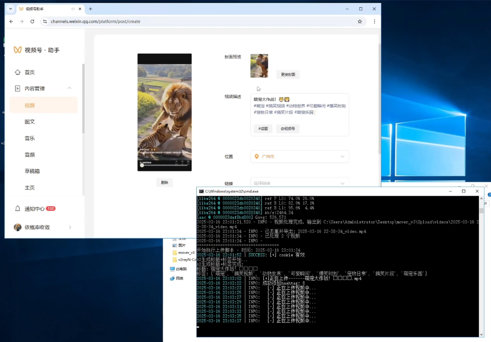

# Video Mover: An Automated Workflow for Video Fetching, Deduplication, and Publishing

[简体中文](./README.md) | [English](./README_en.md)

[](https://github.com/toki-plus/video-mover/stargazers)
[](https://github.com/toki-plus/video-mover/network/members)
[](https://choosealicense.com/licenses/mit/)
[](https://github.com/toki-plus/video-mover/pulls)

**Video Mover is a powerful, fully automated content creation pipeline tool designed for unattended operation, from monitoring and downloading source videos to deep reprocessing and auto-publishing across multiple platforms.**

This project is built for teams and individuals who require large-scale, high-efficiency video content distribution and reprocessing. It integrates complex video processing flows into a complete, modular automation solution.

<p align="center">
  <a href="https://www.bilibili.com/video/BV1txQeYyEEz" target="_blank">
    
  </a>
  <br>
  <em>(Click the cover to watch the HD demo video on Bilibili)</em>
</p>

---

## ✨ Core Features

-   **📥 Auto-Download**
    -   **Real-time Monitoring**: 24/7 automated monitoring of specified TikTok creators for new posts.
    -   **Instant Download**: Immediately downloads new videos without watermarks as soon as they are published, preparing them for subsequent processing.

-   **✂️ Intelligent Deduplication**
    -   A powerful toolbox for video reprocessing and modification. All features are configurable and can be combined to achieve the desired level of uniqueness.
    -   **Performance**: **🚀 GPU Acceleration** using NVIDIA GPUs to significantly boost processing speed.
    -   **Content Enhancement**: Auto Subtitles, Custom Titles, Background Music (BGM), Picture-in-Picture (PIP).
    -   **Video Processing**: Silent Clip Removal, Mirroring, Rotation, Cropping, Fade In/Out, Adjustments for saturation, brightness, and contrast.
    -   **Advanced Effects**: Background Blur, Frame Swapping, Color Shifting, Frequency Domain Perturbation, Texture Noise, and dozens of other visual effects.

-   **🚀 AI-Powered Upload**
    -   **AI Title Generation**: Utilizes Alibaba Cloud's Bailian LLM to analyze video content and automatically generate viral titles and tags.
    -   **Automated Publishing**: Simulates browser actions to log into a WeChat Channels account, automatically fill in all required information, and publish the video.

## 📸 Screenshots

<p align="center">
  
  <br>
  <em>Script execution demonstration diagram.</em>
</p>

## 🚀 Quick Start

Please follow the steps below strictly for environment setup.

### System Requirements

1.  **OS**: Windows.
2.  **Software/Tools**:
    | Software/Tool          | Download Link                                                | Notes                                                     |
    | :--------------------- | :----------------------------------------------------------- | :-------------------------------------------------------- |
    | **.NET Framework 4.8** | [Official Download](https://dotnet.microsoft.com/en-us/download/dotnet-framework/thank-you/net48-web-installer) | A Windows system component.                               |
    | **Python 3.12+**       | [Official Download](https://www.python.org/ftp/python/3.12.9/python-3.12.9-amd64.exe) | **Crucially**, check `Add Python to PATH` during installation. |
    | **Node.js 22.x**       | [Official Download](https://nodejs.org/dist/v22.14.0/node-v22.14.0-x64.msi) | The LTS version is recommended.                           |
    | **Git**                | [Official Download](https://git-scm.com/downloads/win)       | Version control tool.                                     |
    | **FFmpeg**             | [Gyan.dev Builds](https://github.com/GyanD/codexffmpeg/releases/download/7.1.1/ffmpeg-7.1.1-full_build.7z) | **Must** be extracted and its `bin` directory added to the system `PATH`. |
    | **Google Chrome**      | [Official Download](https://www.google.com/)                 | Required for automated uploading.                         |
    | **v2rayN** (Optional)  | [GitHub Releases](https://github.com/2dust/v2rayN/releases/download/5.39/v2rayN-Core.zip) | If you need a proxy to access TikTok.                     |

### Installation and Configuration

1.  **Clone the repository:**
    ```bash
    git clone https://github.com/toki-plus/video-mover.git
    cd video-mover
    ```

2.  **Install dependencies automatically:**
    Double-click `setup.bat` in the project root. This script will install all necessary Python and Node.js dependencies.

3.  **⚠️ IMPORTANT: Manual Patching of Dependencies**
    To ensure the program runs correctly, a few lines of code in the installed Python libraries must be manually modified. Find the corresponding files in your virtual environment:

    -   **File 1**: `f2/apps/tiktok/handler.py`
        -   **Location**: Line `389`
        -   **Action**: Force-cast `cursor` to an `int`.
        -   **Before**: `params={"cursor": cursor, ...}`
        -   **After**: `params={"cursor": int(cursor), ...}`

    -   **File 2**: `f2/utils/utils.py`
        -   **Location**: Around line `200`
        -   **Action**: Modify date handling logic to support different formats.
            ```python
            # Replace this block:
            if date_type == "start":
                date_str = f"{start_date} 00-00-00"
            elif date_type == "end":
                date_str = f"{end_date} 23-59-59"

            # With this:
            if len(start_date.split()) == 1:
                if date_type == "start":
                    date_str = f"{start_date} 00-00-00"
                elif date_type == "end":
                    date_str = f"{end_date} 23-59-59"
            else:
                if date_type == "start":
                    date_str = f"{start_date}"
                elif date_type == "end":
                    date_str = f"{end_date}"
            ```
        -   **Location**: Around line `690`
        -   **Action**: Modify date string parsing logic.
            ```python
            # Replace:
            start_date = datetime.datetime.strptime(start_str, "%Y-%m-%d")
            end_date = datetime.datetime.strptime(end_str, "%Y-%m-%d") + datetime.timedelta(...)

            # With:
            if len(start_str.split()) == 1:
                start_date = datetime.datetime.strptime(start_str, "%Y-%m-%d")
            else:
                start_date = datetime.datetime.strptime(start_str, "%Y-%m-%d %H-%M-%S")
            if len(end_str.split()) == 1:
                end_date = datetime.datetime.strptime(end_str, "%Y-%m-%d") + datetime.timedelta(days=1, seconds=-1)
            else:
                end_date = datetime.datetime.strptime(end_str, "%Y-%m-%d %H-%M-%S")
            ```
    -   **File 3**: `tencent_uploader/main.py`
        -   **Location**: Around line `191`
        -   **Action**: Extend the page wait timeout.
        -   **Before**: `await page.wait_for_url(".../post/list", timeout=1500)`
        -   **After**: `await page.wait_for_url(".../post/list", timeout=10000)`

4.  **Configure Keys and Cookies**
    -   **Alibaba Cloud Bailian API Key**: Get your API Key from the Alibaba Cloud Bailian platform, then open `Upload/vx_upload.py` and insert your key.
    -   **TikTok Cookie**: Log in to the TikTok web version, open developer tools (F12), copy the `Cookie` value, and paste it into `my_apps.yaml` in the root directory.
    -   **Proxy (Optional)**: Modify the `Proxy` settings in the `my_apps.yaml` file if needed.

## 📖 Usage Guide

1.  Double-click `start.bat` in the root directory to run the project.
2.  The program will open a browser and start the tasks. Follow any on-screen prompts for login, etc.
3.  In the developer tools, click the green triangle arrow (usually "Resume script execution") to continue the automation process.

---

<p align="center">
  <strong>For technical inquiries, please connect via:</strong>
</p>
<table align="center">
  <tr>
    <td align="center">
      
      <br />
      <sub><b>WeChat</b></sub>
      <br />
      <sub>ID: toki-plus (Note: "GitHub Customization")</sub>
    </td>
    <td align="center">
      
      <br />
      <sub><b>Public Account</b></sub>
      <br />
      <sub>Scan for tech articles & project updates</sub>
    </td>
  </tr>
</table>

## 📂 My Other Open-Source Projects

-   **[AI-TTV-Workflow](https://github.com/toki-plus/ai-ttv-workflow)**: An AI-driven text-to-video tool that automatically converts any script into a short video with voiceover, subtitles, and a cover. Supports AI script extraction, rewriting, and translation.
-   **[AB Video Deduplicator](https://github.com/toki-plus/AB-Video-Deduplicator)**: Fundamentally alters a video's data fingerprint using an innovative "high-frame-rate blending" technique to bypass originality checks on major short-video platforms.

## 🤝 Contributing

Contributions of any kind are welcome! If you have ideas for new features, have found a bug, or have suggestions for improvements, please:
-   Open an [Issue](https://github.com/toki-plus/video-mover/issues) to start a discussion.
-   Fork the repository and submit a [Pull Request](https://github.com/toki-plus/video-mover/pulls).

If you find this project helpful, please consider giving it a ⭐!

## 📜 License

This project is licensed under the MIT License. See the [LICENSE](LICENSE) file for details.
