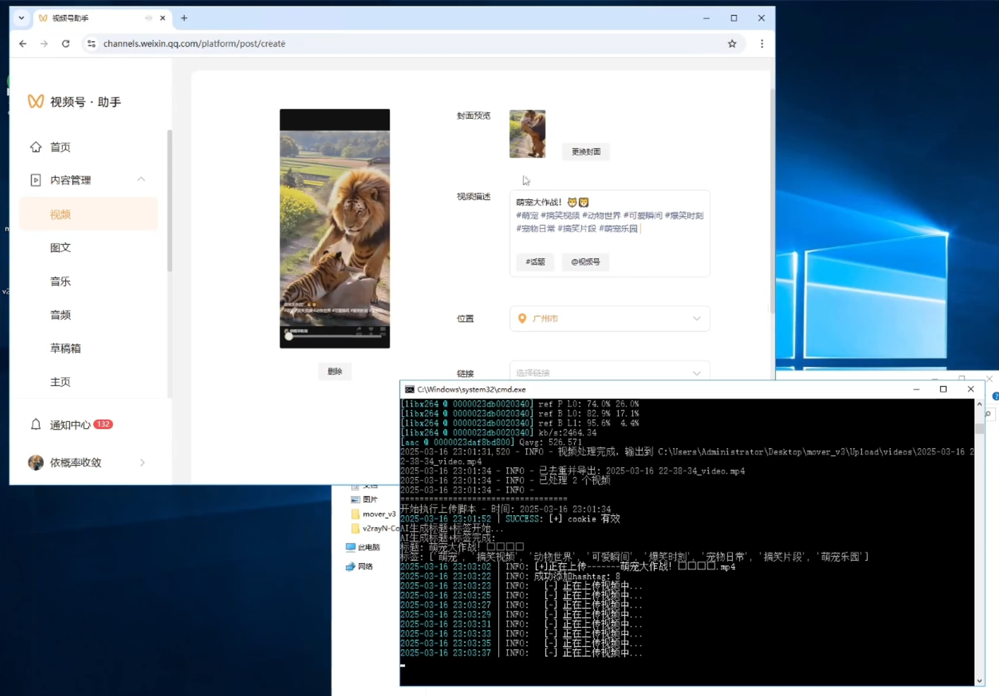

# Video Mover: An Automated Multi-Platform Content Distribution Pipeline

[简体中文](./README.md) | [English](./README_en.md)

A configurable video-processing and publishing workflow for multi-platform content operations.

The project connects file monitoring, media processing, metadata generation, scheduling, and platform-specific publishing in one pipeline. It explores how repetitive content operations can be made more consistent and observable. Each stage is an independent module that can be combined, replaced, or disabled as needed.

> Use this project only with content and accounts you are authorized to manage. Users are responsible for complying with copyright requirements, platform policies, and applicable laws.

## Context

Multi-platform publishing often involves disconnected manual steps: receiving assets, normalizing media, preparing copy, scheduling posts, and uploading the same content through different interfaces. This creates repetitive work and inconsistent execution.

Video Mover models these steps as composable tasks that can be automated, monitored, and extended. The goal is not to replace the creative work, but to hand deterministic, repetitive labor — processing, copy drafts, scheduling, publishing — to a pipeline, keeping humans on asset selection and final content review.

## Capabilities

- **Directory watching and job triggers**: continuously monitors source folders with Watchdog and starts processing jobs as new files arrive; supports unattended 24/7 operation.
- **Content differentiation toolbox**: a configurable FFmpeg/OpenCV processing chain covering auto subtitles, custom titles, background music (BGM), picture-in-picture (PIP), silent-clip removal, mirroring, rotation, cropping, fade in/out, quality adjustments, and dozens of visual operations such as background blur, frame swapping, color shifting, and texture noise. Every feature is independently configurable and freely composable, aimed at re-creation and asset-normalization scenarios.
- **GPU acceleration**: uses NVIDIA hardware encoding on compatible machines to significantly shorten batch processing time.
- **AI-assisted copy drafts**: integrates Alibaba Cloud Bailian LLM to analyze video content and draft titles and tags, which are reviewed by a human before publishing.
- **Job queues and scheduling**: configures task queues and publishing timetables through APScheduler with unified execution state.
- **Multi-platform publishing adapters**: Playwright-driven browser automation for TikTok, Douyin, Kuaishou, Bilibili, WeChat Channels, and Xiaohongshu, reusing login sessions and filling upload forms automatically.
- **Extensible architecture**: plugins and handlers extend processing steps and upload adapters; adding a platform or a processing feature does not require changing the core flow.
- **Logging and status**: full task logs and execution status for failure diagnosis and process review.

## 📸 Screenshots

<p align="center">
  <a href="https://www.bilibili.com/video/BV1txQeYyEEz" target="_blank">
    
  </a>
  <br>
  <em>Application UI (click the cover to watch the demo video on Bilibili)</em>
</p>

<p align="center">
  
  <br>
  <em>Script execution in progress</em>
</p>

## Workflow

```text
Content input
    -> File watcher
    -> Video processing
    -> Metadata generation
    -> Scheduling
    -> Platform adapters
    -> Execution logs
```

## Technical Design

- `main.py`: orchestration, file management, scheduling, and plugin entry point
- `Dedup/`: FFmpeg- and OpenCV-based media processing (implements the toolbox features above)
- `Upload/`: platform adapters and account configuration
- `my_apps.yaml`: application and network settings (input folders, target platforms, proxy, schedules)

Core technologies: Python, FFmpeg, OpenCV, Playwright, Watchdog, APScheduler, and LLM APIs.

## Quick Start

### Requirements

- Windows
- Python 3.12+
- Node.js 22.x
- FFmpeg available on `PATH`
- Chrome

### Installation

1. Clone the repository:

   ```bash
   git clone https://github.com/toki-plus/video-mover.git
   cd video-mover
   ```

2. Run `setup.bat` to install Python, Node.js, Playwright, and related dependencies. An isolated virtual environment is recommended.

3. **Dependency patches (critical step)**: to stay compatible with real platform interfaces, two small changes are required inside the installed third-party libraries in your virtual environment:
   - `f2/apps/tiktok/handler.py` (~line 389): change `params={"cursor": cursor, ...}` to `params={"cursor": int(cursor), ...}`;
   - `f2/utils/utils.py` (~lines 200 / 690): extend date-string parsing to accept both `YYYY-MM-DD` and datetime formats;
   - `tencent_uploader/main.py` (~line 191): raise the page-navigation wait timeout from 1500ms to 10000ms to avoid false failures on slow networks.

### Configuration

1. Configure input folders, target platforms, account files, proxy settings, and schedules in `my_apps.yaml`.
2. If AI-assisted copy is enabled, provide API credentials through secure local configuration — never commit them.
3. Initialize account sessions and cookies when running a platform adapter for the first time.

### Run

Double-click `start.bat`, or execute:

```bash
python main.py
```

The program opens a browser and starts the tasks; complete the first login as prompted, then the pipeline runs automatically.

## Current Limitations

- Platform adapters may require updates when third-party pages or interfaces change.
- Some upstream dependencies have version-specific compatibility requirements.
- The project does not yet include comprehensive automated tests or CI.
- API keys, cookies, and account configuration must never be committed to the repository.

## What This Project Demonstrates

The primary focus is workflow decomposition and cross-system orchestration: turning file watching, media processing, LLM calls, scheduling, and browser automation into an observable, recoverable pipeline — defining task boundaries, integrating third-party systems, recording failures, and leaving clear extension points. It is not intended as a showcase of a single media-processing algorithm. Details such as "upstream libraries need manual patches to stay compatible with live platform interfaces" also illustrate the hidden integration costs typical of real-world automation projects.

## 📂 More Projects

- [ai-highlight-clip](https://github.com/toki-plus/ai-highlight-clip) — Long-video smart triage: Whisper transcription + LLM scoring + human review
- [ai-ttv-workflow](https://github.com/toki-plus/ai-ttv-workflow) — Desktop text-to-video workflow with human-in-the-loop checkpoints
- [ai-video-workflow](https://github.com/toki-plus/ai-video-workflow) — Multi-model AIGC video pipeline orchestrating image, video and music services
- [ai-mixed-cut](https://github.com/toki-plus/ai-mixed-cut) — Video re-creation workflow via structured asset library and script reassembly
- [ai-trader-for-mt4](https://github.com/toki-plus/ai-trader-for-mt4) — LLM×MT4 controlled-execution framework: constrained tools, risk rules, state management
- [ai-trader-for-mt5](https://github.com/toki-plus/ai-trader-for-mt5) — AI trading assistant and EA engineering framework for MetaTrader 5
- [auto-usps-tracker](https://github.com/toki-plus/auto-usps-tracker) — Batch shipment tracking and Excel reporting for cross-border e-commerce
- [AB-Video-Deduplicator](https://github.com/toki-plus/AB-Video-Deduplicator) — Experimental video re-creation tool based on high-frame-rate blending
- [netease-downloader](https://github.com/toki-plus/netease-downloader) — Netease Cloud Music desktop downloader: QR login, queue, ID3 tagging

## License

See [LICENSE](./LICENSE).
